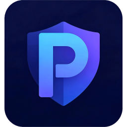
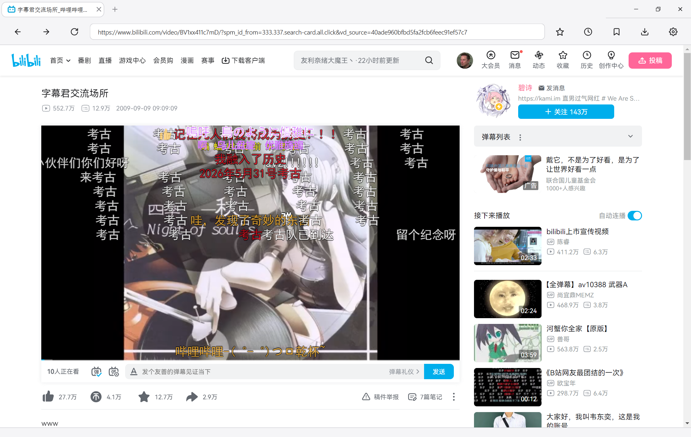
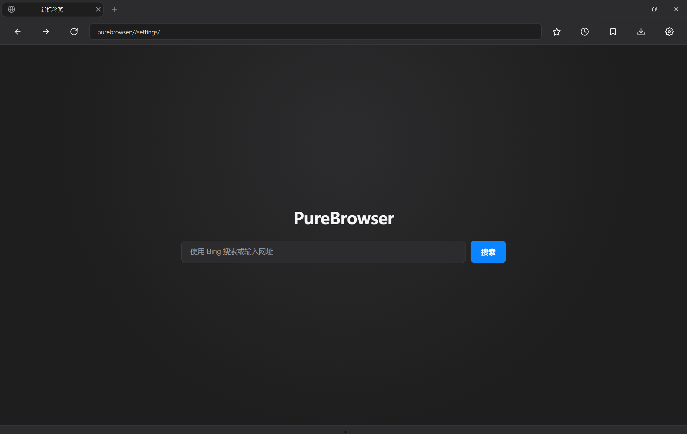
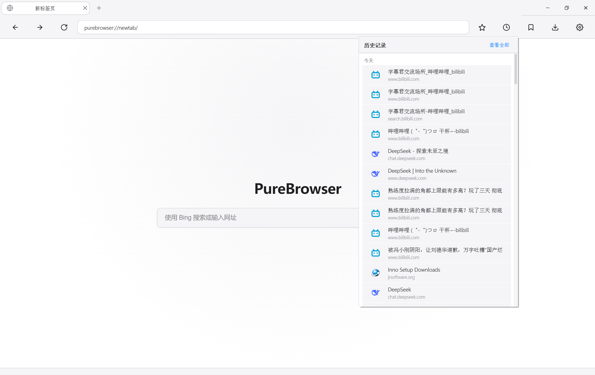
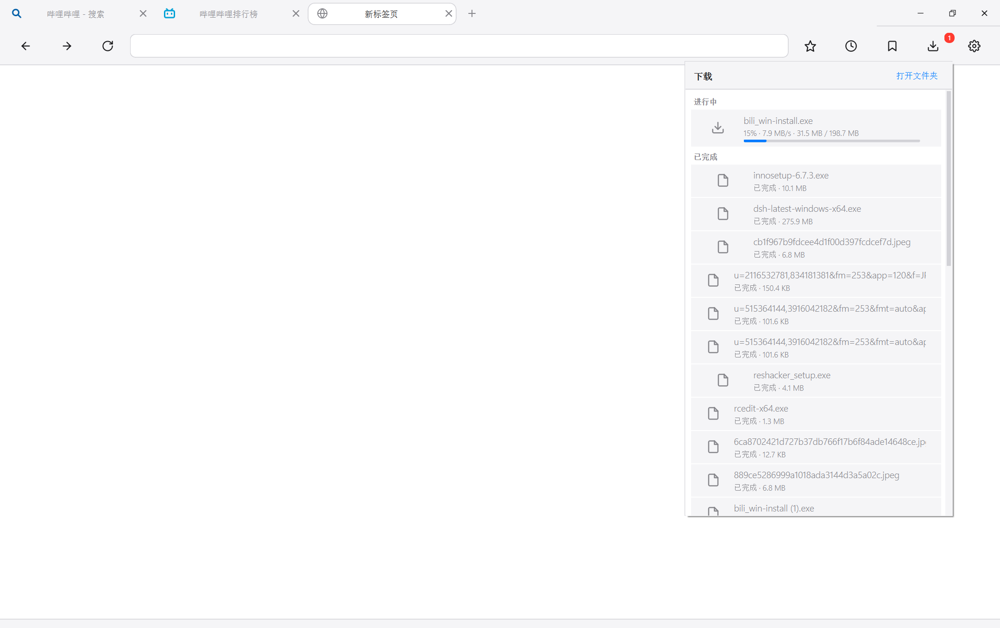
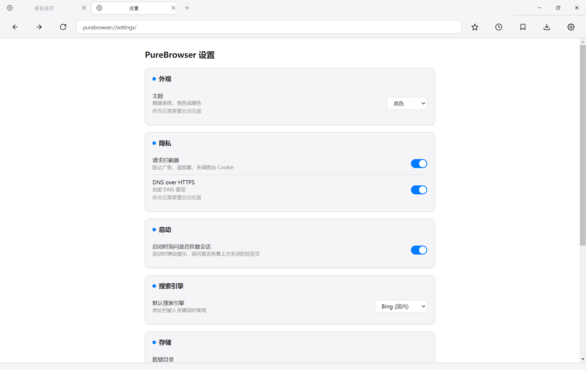

<p align="center">
  
</p>

<h1 align="center">PureBrowser</h1>

<p align="center"><b>一个用 Python 就能改的、自带 H.264 的隐私浏览器。</b></p>

<p align="center">
  <a href="README.md">English</a> | <a href="README.zh-CN.md">中文</a>
</p>

<p align="center">
  <a href="https://github.com/ElovisiaWinslow/purebrowser/releases/latest"></a>
  <a href="https://github.com/ElovisiaWinslow/purebrowser/releases"></a>
  <a href="./LICENSE"></a>
  
  
  
</p>

---

## 这是什么

PureBrowser 是一个 **Windows x64 桌面浏览器**，基于 **PyQt6 + 自编译 QtWebEngine 6.7.3**。
它解决一个生态级痛点：

> **Qt 官方 pip wheel 不带 H.264 解码器，导致 B 站、腾讯视频等网站报"当前浏览器不支持 HTML5 播放器"。**

本项目从源码编译 QtWebEngine，启用 `-webengine-proprietary-codecs`，让 Python 也能拥有一个能播视频的浏览器。
完整的编译过程和所有 patch 记录在 [`docs/BUILD_NOTES.md`](docs/BUILD_NOTES.md)。

## 三个核心差异点

### 1. 自带 H.264（这最难）

- 自编译 Qt 6.7.3 + QtWebEngine，显式开启 proprietary codecs
- 手改 `environment.x64`、`toolchain.ninja`、`build.ninja`，切换 v142/v143 编译器，绕过 MSVC 回归 bug
- 完整可复现步骤在 `docs/BUILD_NOTES.md`
- 结果：B 站视频直接播，画面声音正常

### 2. 纯 Python 可开发

- 技术栈：Python 3.10 + PyQt6 6.7.1 + 自编译 QtWebEngine 6.7.0 / Qt 6.7.3
- 所有 UI、隐私策略、拦截规则都在 `src/purebrowser/` 下的 Python 文件里
- 改一行 py 文件就有效果，不需要重编 C++
- 对比 ungoogled-chromium / LibreWolf：那些是 C++ 项目

### 3. 隐私优先 + 可审计

- 无遥测、无崩溃上传、无 RLZ、无设备 ID
- HTTP 请求默认升级为 HTTPS
- 默认 DoH（阿里 DNS，国内可达）
- 跨站请求剥离 Cookie + 分区 Cookie（`PartitionedCookies`）
- 内置常见广告/追踪域名黑名单（约 22 条，可在设置里关闭）
- 所有站点权限默认拒绝（地理位置、通知、摄像头、剪贴板）
- 页面不能弹窗、不能读剪贴板
- 新标签页纯本地：无新闻、无推荐、无广告
- 数据本地 SQLite，无云端同步，无账号系统

**可自行复现网络审计**：设置 `PUREBROWSER_NETLOG=路径` 启动，再用 `tools/audit/net_audit.py` 分析。

---

## 系统要求

| 组件 | 版本 | 来源 |
|---|---|---|
| 操作系统 | Windows 10/11 **x64** | — |
| Python | **3.10.11**（项目 venv） | python.org |
| PyQt6 | 6.7.1 | **自编译 wheel**，非 PyPI |
| PyQt6_sip | 13.8.0 | PyPI |
| PyQt6-WebEngine | 6.7.0 | **自编译 wheel**，非 PyPI |
| Qt / QtWebEngine | 6.7.3 + H.264 | **自编译**，装在 `D:\develop\Qt6-custom` |

必需环境变量（用户级）：`QT_PLUGIN_PATH` 指向自编译 Qt 的 `plugins`，`PATH` 包含其 `bin`。

纯 Python 依赖（`pyproject.toml`）：`httpx`、`platformdirs`。

---

## 快速开始

### 普通用户

> 安装包尚未正式发布。当前状态为 **Alpha**。

### 开发者：克隆即跑

```bash
git clone https://github.com/<your-name>/purebrowser.git
cd purebrowser
```

**第 1 步：Python 环境**

```cmd
python -m venv .venv
.venv\Scripts\activate
pip install -e .
```

`pip install -e .` 只装 `httpx` 和 `platformdirs`，不会碰 Qt。

**第 2 步：装自编译的 PyQt6（不用自己编）**

从 [Releases](https://github.com/<your-name>/purebrowser/releases) 下载：

- `PyQt6-6.7.1-cp38-abi3-win_amd64.whl`
- `PyQt6_WebEngine-6.7.0-cp38-abi3-win_amd64.whl`
- `Qt6-custom.zip`（约 500 MB）

```cmd
pip uninstall PyQt6 PyQt6-Qt6 PyQt6-WebEngine PyQt6-WebEngine-Qt6 PyQt6_sip -y

pip install PyQt6-6.7.1-cp38-abi3-win_amd64.whl --no-deps
pip install PyQt6_sip==13.8.0 --no-deps
pip install PyQt6_WebEngine-6.7.0-cp38-abi3-win_amd64.whl --no-deps
```

> **关键**：不要装 `PyQt6-Qt6` 和 `PyQt6-WebEngine-Qt6`，它们会覆盖自编译 Qt。

**第 3 步：部署自编译 Qt**

把 `Qt6-custom.zip` 解压到 `D:\develop\Qt6-custom`，然后设置用户级环境变量：

```powershell
$p = [Environment]::GetEnvironmentVariable("Path", "User")
[Environment]::SetEnvironmentVariable("Path", "D:\develop\Qt6-custom\bin;" + $p, "User")
[Environment]::SetEnvironmentVariable("QT_PLUGIN_PATH", "D:\develop\Qt6-custom\plugins", "User")
```

**关掉所有终端重开**，让环境变量生效。

**第 4 步：运行**

```cmd
python -m purebrowser
```

### 内核维护者：从零自编译

见 [`docs/BUILD_NOTES.md`](docs/BUILD_NOTES.md)。预计 2~5 天，会踩很多坑，但文档记录了每一个。

---

## 打包（Windows）

打包链是 **PyInstaller + Inno Setup**：

| 文件 | 作用 |
|---|---|
| `PureBrowser.spec` | PyInstaller 配方：收集自编译 Qt6 的 DLL/插件/资源与 `QtWebEngineProcess.exe`，入口 `src/purebrowser/__main__.py`。 |
| `runtime_hook.py` | 运行时设置 5 个路径：`QT_PLUGIN_PATH`、`QT_QPA_PLATFORM_PLUGIN_PATH`、`QTWEBENGINEPROCESS_PATH`、`QTWEBENGINE_RESOURCES_PATH`、`QTWEBENGINE_LOCALES_PATH`。 |
| `rebuild.bat` | 一键：关闭旧进程 → `pyinstaller PureBrowser.spec --noconfirm` → Inno Setup `ISCC PureBrowser.iss`。 |
| `PureBrowser.iss` | Inno Setup 脚本；产物 `installer\Output\PureBrowserSetup.exe`。 |

```cmd
rebuild.bat
```

产物：`dist\PureBrowser\`（免安装目录）与 `installer\Output\PureBrowserSetup.exe`（安装包）。

> **可移植性警告**：`PureBrowser.spec`、`rebuild.bat`、`PureBrowser.iss` 里**写死了本机的绝对路径**
> （`D:\PythonProject\purebrowser`、`D:\develop\Qt6-custom`、Inno Setup 安装路径）。换机器打包前请自行修改。

从源码编译 Qt 本身是另一个大工程，见 [`docs/BUILD_NOTES.md`](docs/BUILD_NOTES.md)。

---

## 项目结构

```
purebrowser/
├─ src/purebrowser/
│  ├─ __main__.py / main.py / app.py     # 入口、Chromium flags、QApplication + scheme 注册
│  ├─ core/
│  │  ├─ profile.py                      # QWebEngineProfile：UA、cookie、设置       （冻结）
│  │  ├─ interceptor.py                  # 请求拦截：黑名单、HTTPS、剥离 Cookie     （冻结）
│  │  ├─ privacy/flags.py                # Chromium 命令行参数                      （冻结）
│  │  ├─ settings.py                     # settings.json 读写
│  │  └─ locations.py                    # 数据/缓存/下载路径
│  ├─ data/                              # storage.py history.py bookmarks.py
│  │                                     # favicons.py downloads_store.py session.py
│  ├─ pages/
│  │  ├─ pages.py                        # purebrowser:// 处理 + 历史/设置页
│  │  ├─ newtab.py                       # 新标签页 URL 辅助
│  │  └─ downloads.py                    # DownloadManager
│  └─ ui/
│     ├─ window.py                       # 主窗口、标签、菜单、快捷键、全屏
│     ├─ tab.py / tab_area.py / tabbar.py# 标签控件 + 自适应标签栏
│     ├─ urlbar.py                       # 地址栏 + 补全
│     ├─ theme.py / icons.py             # 主题 token + 内联 SVG 图标
│     ├─ hud.py                          # 缩放/查找浮层、Ctrl+滚轮过滤器
│     ├─ menu_rows.py / context_menu.py  # 共享富行 + 自绘右键菜单
│     ├─ dropdown.py                     # 历史/书签/下载 可滚动下拉面板
│     ├─ session_prompt.py               # "是否恢复会话" 卡片
│     └─ freeze_overlay.py               # 拖动/缩放时的冻结帧
├─ resources/                            # newtab.html、purebrowser.ico
├─ tools/                                # smoke_test / e2e_test / regression_test /
│                                        # fullscreen_harness_test / fullscreen_test / audit/net_audit.py
├─ docs/                                 # BUILD_NOTES.md、assets/（logo + 截图）
├─ PureBrowser.spec / runtime_hook.py / rebuild.bat / PureBrowser.iss
├─ pyproject.toml / requirements.txt
└─ LICENSE / README.md / README.zh-CN.md / AGENTS.md
```

---

## 已实现的功能

**浏览与标签**
- 标签页：自适应（滑动）标签栏、拖拽排序、每个标签自定义关闭键、`+` 新标签
- 重开最近关闭的标签（`Ctrl+Shift+T`）
- 前进 / 后退 / 刷新：`Alt+←/→`、`F5`、`Ctrl+R`

**窗口**
- 自绘标题栏（无边框），原生最小化/最大化/还原
- 记住"最大化 / 窗口化"以及窗口化时的尺寸与位置；下次启动弹出"是否恢复上次会话"提示

**查找与缩放**
- `Ctrl+F` 查找条：命中计数、上一个/下一个、`Esc` 关闭。网页自己实现了 `Ctrl+F` 时**网页优先**，浏览器只在网页不处理时才介入
- 页面缩放：`Ctrl`+滚轮、`Ctrl` `+`/`-`/`0`，带缩放浮层；**逐站点记忆**

**书签与历史**
- `Ctrl+D` 收藏/取消；工具栏星标；书签下拉面板
- 历史存 SQLite，地址栏自动补全；下拉面板按 今天/昨天/更早 分组；`purebrowser://history` 页面

**下载**
- 暂停 / 继续 / 取消 / 重试；记录持久化到 SQLite（保留最近 200 条）
- **下载下拉面板**实时显示进度条、速度、当前体积；工具栏下载按钮带**红点角标**；可打开文件 / 打开所在目录

**菜单**
- 自绘中文右键菜单（链接另存为 / 复制链接、图片另存为 / 复制图片地址、编辑操作、复制/搜索选中文本、前进/后退/刷新）
- 历史 / 书签 / 下载均为**可滚动的主题下拉面板**

**外观**
- 亮色 / 暗色 / 跟随系统，工具栏、菜单、内建页面统一主题

**隐私**
- 内置常见广告/追踪域名黑名单（约 22 条，可在设置关闭）
- HTTP 请求升级为 HTTPS
- 跨站 XHR/媒体请求剥离 `Cookie`，并启用分区 Cookie（`PartitionedCookies`、`ThirdPartyStoragePartitioning`）
- DoH（阿里 DNS，国内可达）
- 无遥测 / 崩溃上传 / RLZ / 设备 ID；所有站点权限默认拒绝；页面不能弹窗、不能读剪贴板
- 允许持久 Cookie（登录状态跨会话保留）；数据仅本地 SQLite

**本地页与工具**
- `purebrowser://newtab`、`purebrowser://history`、`purebrowser://settings`
- 设置：主题、拦截器开关、DoH 开关、会话恢复开关、搜索引擎、数据/下载/缓存目录、清除缓存/历史
- 数据目录可配置（`location.txt`）
- 网络审计：`PUREBROWSER_NETLOG=路径` 启动，`tools/audit/net_audit.py` 分析

**编解码**
- H.264（来自自编译 QtWebEngine，本项目的核心卖点）

---

## 与主流方案对比

| 特性 | **PureBrowser** | ungoogled-chromium | qutebrowser | LibreWolf |
|---|---|---|---|---|
| 开发语言 | **Python** | C++ | Python | C++ |
| 自带 H.264 | **是** | 需自行处理 | 否 | 是 |
| 自编译内核 | 是 | 是 | 否 | 是 |
| 无遥测 | 是 | 是 | 是 | 是 |
| 改一改就跑 | 改 py | 重编几小时 | 改 py | 改 C++ |
| 项目定位 | 学习 / 定制 / 研究 | 硬核用户 | 键盘党 | 隐私用户 |

---

## 截图


| 主界面（亮色） | 主界面（暗色） |
|---|---|
|  |  |

| 历史面板 | 下载面板 |
|---|---|
|  |  |

| 右键菜单 | 设置页 |
|---|---|
|  |  |

---

## Roadmap

**已完成**
- [x] 从源码编译 QtWebEngine 6.7.3 + H.264
- [x] 基础 UI + 拦截器 + 隐私默认策略
- [x] 历史、书签、下载、设置页
- [x] 查找条、页面缩放、favicon
- [x] 自绘中文菜单 + 可滚动下拉面板
- [x] 会话恢复提示 + 窗口状态记忆
- [x] Windows 打包（PyInstaller + Inno Setup）

**待办**
- [ ] 自动更新（自建更新服务 + 签名）
- [ ] Linux / macOS 支持
- [ ] 扩展系统（可选）
- [ ] E2EE 同步（可选，默认关闭）
- [ ] 完整 EasyList 规则、书签管理页、隐私窗口、按站点授予权限

## 已知限制

- **仅 Windows x64。**
- 广告拦截是**内置的小型域名黑名单（约 22 条）**，不是 EasyList/EasyPrivacy。
- 没有"按站点授予权限"——所有权限请求一律拒绝。
- 没有扩展、没有同步、没有账号、没有自动更新、没有多 profile、没有隐私/无痕窗口。
- 内建页面只有 新标签 / 历史 / 设置（没有独立的书签管理页）。
- **恢复下载**只在同一次会话内有效；重启后"进行中"会被标记为已中断，需要重新下载。
- 会话恢复记住的是 URL，不含表单/滚动位置等完整状态。

---

## 常见问题

**Q: 为什么下载 PyQt6 要用自编译的，不用 pip 上的？**
A: pip 上的 PyQt6 带的 Qt 是官方编译的，**不含 H.264**。自编译的版本才带。两者可以共存，但不要混用同一个 venv。

**Q: 为什么只支持 Windows？**
A: 当前版本只在 Windows x64 上验证过。QtWebEngine 的构建脚本、patch、依赖 DLL 都针对 Windows 调过。Linux 版需要重新走一遍 BUILD_NOTES 里的流程。

**Q: 能不能直接用 PySide6？**
A: 不行。PySide6 官方 wheel 同样不带 H.264，而且它的 QtWebEngine 版本与 PyQt6 不完全对应。项目使用 PyQt6 6.7.1 + 自编译 Qt 6.7.3。

**Q: 为什么仓库里不直接附带 Qt6-custom？**
A: 太大会超过 GitHub 单文件限制（解压后 >2 GB）。Qt6-custom 打包后约 500 MB，放在 Releases 附件里。

**Q: 和 ungoogled-chromium 有什么区别？**
A: ungoogled-chromium 是 C++ 项目，改一行要重编。PureBrowser 是 Python 项目，改一行 py 文件就有效果。定位不同。

**Q: 为什么用 PyInstaller 而不是 Nuitka？（旧文档提过 Nuitka）**
A: 当前可用的流水线是 PyInstaller（`PureBrowser.spec` + `runtime_hook.py`），外层 Inno Setup（`PureBrowser.iss`），由 `rebuild.bat` 驱动。旧的 Nuitka 说明已过时。

**Q: 为什么拦截列表这么小？**
A: 这是刻意做成"零依赖的内置域名黑名单"。欢迎 PR 提供更大、有人维护的规则集，见 Roadmap。

## 贡献

欢迎任何形式的贡献：

- 提 Issue 报告 bug 或功能建议
- 提交 PR 修改代码
- 复现 `BUILD_NOTES.md` 并在 Issue 里报告新坑
- 翻译文档

## 许可

项目自有代码（`src/`、`tools/` 等）采用 **MPL-2.0**，见 [LICENSE](LICENSE)。

分发的二进制还会链接 **GPL 版 PyQt6**，因此二进制分发整体视为 GPL-3.0。若计划闭源商用，请向 Riverbank 购买 PyQt6 商业许可，并遵守 Qt 商业条款。

*最后更新：2026-10-01*
